# QueryCompass - System Architecture & Documentation

> **AI-Powered Natural Language to SQL Database Query Agent**

A full-stack application that allows users to query databases using natural language, visualize results, and design database schemas through conversational AI.

---

## 1. System Overview

QueryCompass is an intelligent database assistant designed to bridge the gap between non-technical users and complex SQL databases.

**Key Capabilities:**
- **Natural Language Understanding**: Transforms questions like "Show me top selling products in NY" into optimized SQL.
- **Safety First**: Implements rigorous SQL verification to prevent injection/destructive queries.
- **Visual Schema Design**: Allows users to architect databases conversationally ("Add a users table with email").
- **Smart Visualization**: Automatically selects the best chart type (Bar, Line, Pie) for the data.

---

## 2. Technology Stack

| Layer | Technology | Version | Purpose |
|-------|------------|---------|---------|
| **Frontend** | React | 19.x | Component-based UI |
| | Vite | 6.x | Fast build tool |
| | TailwindCSS | 3.4 | Utility-first styling |
| | Recharts | 2.15 | Data visualization |
| **Backend** | Node.js | 20.x | Runtime environment |
| | Express | 5.0 | Web framework |
| | Google Gemini | 1.5/2.5 | LLM for all AI agents |
| **Database** | PostgreSQL | 15.x | Primary user data store |
| | MongoDB | 6.x | System metadata (logs, chats) |
| **DevOps** | Docker | 24.x | Containerization |

---

## 3. Architecture Diagrams

### 3.1 High-Level Architecture


### 3.2 AI Agent Pipeline

The core of QueryCompass is a multi-step AI pipeline that ensures accuracy and safety.

```mermaid
sequenceDiagram
    participant User
    participant Router as 🧠 Router Agent
    participant SQLGen as 📝 SQL Generator
    participant SQLVer as 🛡️ SQL Verifier
    participant DB as 💾 PostgreSQL
    participant Viz as 📊 Viz Agent
    participant User

    User->>Router: "Show top 5 sales in 2024"
    Router->>Router: Analyze Intent
    Router->>SQLGen: Route: "database_query"
    SQLGen->>SQLGen: Generate SQL
    SQLGen->>SQLVer: Verify Safety
    
    alt SQL is Safe
        SQLVer->>DB: Execute Query
        DB-->>Viz: Raw Data
        Viz->>Viz: Select Chart Type
        Viz-->>User: ID, Data + Chart Config
    else SQL is Unsafe
        SQLVer-->>User: Block & Explain Risk
    end
```



### 3.3 Database Schema (ERD)

The system manages user databases dynamically. Below is the default `sales_db` schema.


---

## 4. Workflows & Data Flow

### 4.1 Request Lifecycle (Natural Language Query)

1.  **User Input**: User sends "Who spent the most last month?" via `ChatInput`.
2.  **Authentication**: `authMiddleware` validates the JWT token.
3.  **Routing**:
    -   `agentController` receives the request.
    -   **Router Agent** analyzes the prompt + history to decide if it's a query (`database_query`) or chat (`general_conversation`).
4.  **SQL Generation**:
    -   **SQL Generator** receives the *database schema only* (no data) and the user prompt.
    -   It produces a candidate SQL query associated with `sales_db`.
5.  **Verification**:
    -   **SQL Verifier** checks the generated SQL for `DROP`, `DELETE`, `ALTER`, or injection patterns.
    -   It creates a "Safe/Unsafe" verdict and logic explanation.
6.  **Execution** (if Safe):
    -   `sqlExecutor` runs the query using `dbPoolManager` connection pool.
    -   Query is logged to `audit_logs` in MongoDB.
7.  **Result Interpretation & Visualization**:
    -   **Result Interpreter** summarizes the raw rows in plain English.
    -   **Visualization Agent** analyzes the data shape (e.g., time-series data => Line Chart, categorical => Bar Chart).
8.  **Response**: The frontend receives a JSON payload with: `{ text, sql, data, visualization }`.

### 4.2 Schema Design Workflow

1.  **Mode Switch**: User enables "Schema Designer" toggle.
2.  **Interaction**: User says "Create a Users table".
3.  **Schema Designer Agent**:
    -   Reads current in-memory schema state.
    -   Updates the JSON schema representation.
    -   Example: Adds `users` table with standard fields (`id`, `created_at`).
4.  **Feedback**: The system visualized the new table structure in the side panel.
5.  **Commit**: User clicks "Create Database".
    -   System generates `CREATE TABLE` DDL.
    -   Executes distinct transaction to create the physical database in PostgreSQL.

---

## 5. Security Architecture

### 5.1 SQL Safety
-   **No Direct Execution**: User input never goes directly to the database.
-   **Verification Layer**: A dedicated AI agent reviews every generated SQL statement specifically looking for destructive commands (`DROP`, `TRUNCATE`) before execution.
-   **Read-Only User**: The PostgreSQL connection defaults to a user with `SELECT` privileges only (can be configured).

### 5.2 Authentication
-   **JWT Tokens**: Stateless authentication using `jsonwebtoken`.
-   **Bcrypt Hashing**: Passwords are hashed with usage of `bcryptjs` before storage in MongoDB.

### 5.3 PII & Data Privacy
-   **Schema-Only Access**: The SQL Generator Agent *never* sees actual table rows, only column names/types.
-   **Runtime Guards**: (Configurable) The `aiClient` supports regex-based PII blocking to prevent sensitive data patterns from being sent to the LLM.

---

## 6. Frontend Architecture (Deep Dive)

### 6.1 State Management
-   **Context API**: `AuthContext` manages global user session (`user`, `login`, `logout`).
-   **Custom Hooks**:
    -   `useChatMessages`: Handles the complex SSE (Server-Sent Events) connection for real-time "thinking" steps.
    -   `useSchemaMode`: Encapsulates the logic for the split-pane designer, including drag-and-drop sizing.

### 6.2 Component Hierarchy
-   `App`
    -   `AuthProvider`
        -   `LoginPage` (Public)
            -   `HeroSection`, `FeaturesSection`, `AuthModal`
        -   `ChatWindow` (Private)
            -   `Sidebar`: Conversation history list
            -   `MessageList`: Renders chat bubbles
                -   `ChatMessage`: Conditional rendering of Text vs Chart
                    -   `SmartVisualizer`: Recharts wrapper
            -   `SchemaPanel`: The designer interface (conditionally rendered)

---

## 7. Setup & Configuration

### Environment Variables

| Variable | Description |
|----------|-------------|
| `GEMINI_API_KEY` | Required. Access token for Google Generative AI. |
| `POSTGRES_HOST` | Hostname for user data store. |
| `MONGO_URI` | Connection string for system metadata. |
| `JWT_SECRET` | Secret key for signing auth tokens. |

See `backend/.env.example` for full list.

### Running Locally

```bash
# 1. Start Infrastructure
docker-compose up -d

# 2. Backend
cd backend
npm install
npm run dev

# 3. Frontend
cd frontend
npm install
npm run dev
```

---

*Documentation v1.1 - Updated Jan 2026*
